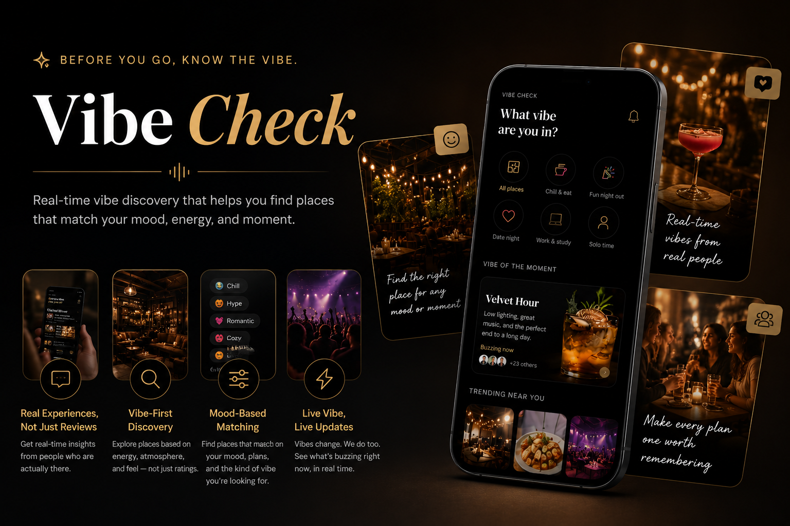

# vibecheck

VibeCheck is a real-time vibe discovery platform that helps people understand what a place actually *feels* like before going there.

---

## Live Experience

- [🚀 Live Prototype](https://sanyukta-jha.github.io/vibecheck/)
- [📖 Product Case Study](https://sanyukta-jha.github.io/vibecheck/vibecheck_product_case_study.html)

---

## The Idea

Most platforms tell people *what* a place is.  
VibeCheck helps people understand *how it feels* before they go.

Built around:
- mood-based discovery
- real-time social energy
- live updates
- vibe-first exploration
- real user experiences

---

## Product Work

- 35 user interviews
- 4 prototype iterations
- Competitive analysis
- User testing observations

---

## Future Vision

Future iterations may include:
- real-time vibe updates
- crowd/activity signals
- creator-driven stories
- personalized recommendations
- social planning features
- AI-powered vibe matching
